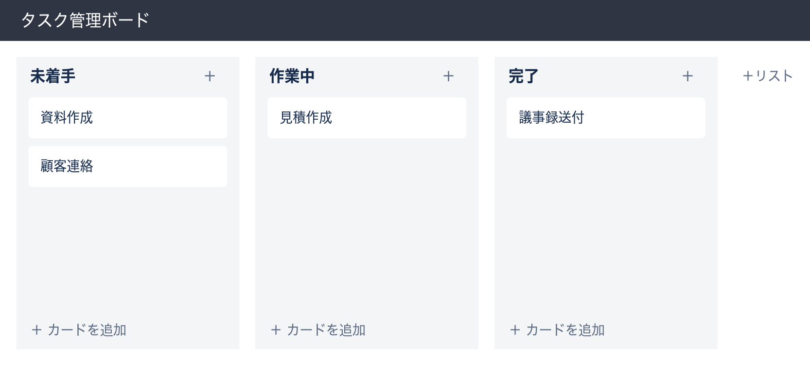

# Trello風タスク管理アプリ 要件定義書

## 1. 概要
Trelloのような、リスト（列）とカードでタスクを管理できるシンプルなWebアプリを作成する。
まずは必要最小限の機能に絞った第一版（MVP）として位置づけ、実際の利用状況を見ながら段階的に機能を拡張していくことを想定する。

## 2. 背景・目的
- タスクの管理をメモや口頭のやり取りに頼っていると、進捗状況が分かりにくく、対応漏れが発生しやすい
- タスクを「未着手」「作業中」「完了」のような列（レーン）で視覚的に管理できるようにし、状況を一目で把握できるようにする
- カードをドラッグ&ドロップで移動するだけで進捗を更新できるようにし、入力の手間を最小限にする
- 本アプリの導入により、タスクの抜け漏れ防止と状況共有の効率化を図る

## 3. 利用者・想定利用シーン
- 第一版では、利用者本人1名のみが利用する想定とする（複数名での共有・同時編集は対象外）
- ログイン機能は設けず、本人のみがアクセスできる環境（社内ネットワーク等）での利用を前提とする
- 将来的に複数人での利用が必要になった場合は、別途要件を見直し、ログイン機能・権限管理などを追加検討する

## 4. 技術構成
| 項目 | 使用技術 | 補足（一般的な説明） |
|---|---|---|
| フロントエンド | React | 画面（ブラウザ上の見た目・操作部分）を作るための技術 |
| バックエンド | Java（Spring Boot） | データの登録・更新・削除などの処理を行うサーバー側の仕組み |
| データベース | PostgreSQL | タスクやリストの情報を保存しておく仕組み |

※ いずれも実績が豊富で長期的な保守がしやすい技術を採用している。

## 5. 機能要件（最小構成）

### 5.1 リスト（列）
- リストを作成できる（例：未着手／作業中／完了）
- リストを削除できる

### 5.2 カード（タスク）
- カードを作成できる（タイトルのみ）
- カードの内容を編集できる
- カードを削除できる
- カードをドラッグ&ドロップで別のリストに移動できる

## 6. 操作の流れ

典型的な利用シーンにおける操作の流れは以下の通り。

1. ボード画面を開く（アプリ起動時に表示される唯一の画面）
2. 「＋リストを追加」から、リスト（例：未着手／作業中／完了）を作成する
3. 各リストに「＋カードを追加」からタスクを登録する
4. タスクの状況が変わったら、該当のカードを別のリストへドラッグ&ドロップで移動する
5. タスクの内容を変更したい場合はカードをクリックして編集、不要になったら削除する

```
[開始] → リスト作成 → カード作成 → （進捗に応じて）カードを別リストへ移動 → カード編集／削除
```

## 7. 画面構成（案）

### 7.1 画面一覧
- ボード画面（1画面のみ。第一版ではこの画面がすべて）

### 7.2 画面イメージ（ラフスケッチ）



上図をMarkdown表として表現すると、以下のようなレイアウトになる。

| 未着手　[＋カード] | 作業中　[＋カード] | 完了　[＋カード] | ［＋リストを追加］ |
|---|---|---|---|
| 資料作成 | 見積作成 | 議事録送付 | |
| 顧客連絡 | | | |

- 複数のリストを横並びで表示する
- 各リストの中にカードを縦に並べて表示する
- カードはドラッグ&ドロップで別のリストへ移動できる
- 「＋リストを追加」「＋カードを追加」ボタンから新規作成する

※ 上記はレイアウトの方向性を示すラフイメージであり、実際のデザイン（色・フォント・細部の配置）は開発時に別途調整する。

## 8. 非機能要件
- **対応環境**：PCブラウザでの表示・操作を優先する（スマートフォン・タブレットなどのレスポンシブ対応は第一版では必須としない）
- **ログイン・権限**：ログイン機能は実装しない（[3. 利用者・想定利用シーン](#3-利用者想定利用シーン)の通り、本人のみの利用を前提とするため）
- **性能**：数十件程度のリスト・カード数を想定した動作とし、大量データ（数千件単位）を扱う想定はしない
- **データの保存**：入力したデータはデータベースに保存され、ブラウザを閉じても消えない
- **バックアップ**：第一版では自動バックアップの仕組みは設けない（必要な場合は別途対応を検討する）
- **セキュリティ**：社内ネットワーク等、限定された環境での利用を前提とし、外部からの不特定多数のアクセスを想定したセキュリティ対策（不正アクセス対策など）は第一版のスコープ外とする

## 9. データ構造（案）

### list（リスト）
| カラム名 | 型 | 説明 |
|---|---|---|
| id | 数値 | 主キー |
| title | 文字列 | リスト名 |
| position | 数値 | 表示順 |

### card（カード）
| カラム名 | 型 | 説明 |
|---|---|---|
| id | 数値 | 主キー |
| list_id | 数値 | 所属するリストのid |
| title | 文字列 | カードのタイトル |
| position | 数値 | リスト内の表示順 |

## 10. 対象外（今回は作らない機能）
- ユーザー登録・ログイン
- カードへのラベル・期限・添付ファイル
- 複数ボードの管理
- コメント機能

## 11. 受け入れ基準（完成の判断基準）
以下がすべて満たされた状態をもって、第一版の完成とする。
- リストの作成・削除ができること
- カードの作成・編集・削除ができること
- カードをドラッグ&ドロップで別のリストへ移動でき、移動後も状態が保持されること（画面を再読み込みしても内容が消えないこと）
- PCの主要ブラウザ（Google Chrome最新版）で問題なく表示・操作できること

## 12. 運用・保守について
- 第一版はまず動作を確認しながら試験的に利用する位置づけとし、正式な運用体制（問い合わせ窓口・障害対応フロー等）は今回のスコープには含まない
- 利用を進める中で不具合や追加要望が出た場合は、都度相談のうえ対応を検討する
- サーバー・データベースの保守（アップデート対応等）についても、今回は開発環境での稼働を前提とし、本番運用を見据えた保守計画は別途検討する

## 13. 前提条件・制約事項
- 本要件定義は第一版（MVP）を対象としたものであり、記載外の要望については範囲外とする
- 動作確認は主にPC・Google Chromeを前提とし、他ブラウザでの表示崩れ等は許容する
- 実際の開発を進める中で、仕様の詳細が変わる可能性がある（変更が生じた場合は都度共有する）
